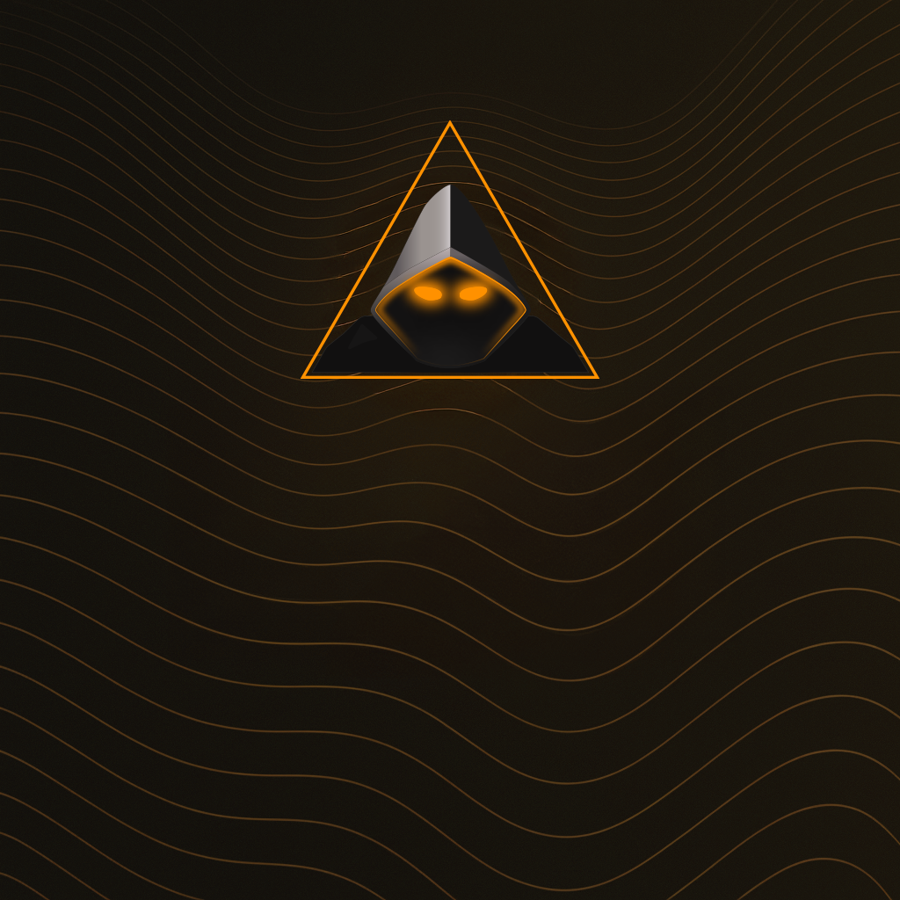

<div align="center">
  
  <h1 style="margin-top:24px;">Mort Branding</h1>
  <p><strong>Cinematic visual identity system for the hooded-amber universe</strong></p>
  <p>logos • backgrounds • design assets • brand guidelines</p>
</div>

---

## Immersive overview

- **Hooded sigil** – primary logo variants in `design.png` and `image.png` with glowing ember eyes and techflow backgrounds.
- **Logo library** – `logos/CLEAR/` and `logos/SOLID/` provide 20+ variants for transparent and opaque contexts.
- **Background collection** – `backgrounds/` hosts cinematic techflow wallpapers in standard and wide formats for desktop and presentation use.
- **Brand DNA** – deep obsidian `#050505`, ember glow `#F18F01`, tungsten `#1A120B`, and accent smoke `#43362D` define the palette.
- **Geometric language** – triangular frames, ambient wave fields, and flowing contour lines echo the sigil's architectural form.

---

## Brand system & complementary graphics

### Color palette (exact hex codes)

- **Deep obsidian** `#050505` – primary background, foundation of the dark aesthetic
- **Ember glow** `#F18F01` – accent color for hooded logo eyes, highlights, and call-to-action elements
- **Tungsten** `#1A120B` – secondary dark for depth and contrast
- **Accent smoke** `#43362D` – subtle warm highlights for texture and atmosphere
- **Gradient range** `#050505` → `#120B08` – smooth transitions for backgrounds and UI surfaces

### Visual identity elements

- **Hooded sigil** – the primary logo mark (circle or triangle variant with glowing orange eyes)
- **Techflow backgrounds** – waves, particles, dotted grids, small squares in warm tones
- **Triangular frames** – geometric shapes echoing the sigil design language
- **Ambient wave fields** – 1px lines with 32px spacing following golden triangle direction

### Typography recommendations

- **Headings** – geometric sans-serif (Inter, Space Grotesk, or similar) for clean, modern hierarchy
- **Code & monospace** – neutral mono (JetBrains Mono, Fira Code) for technical content
- **Body text** – readable sans-serif with good contrast on dark backgrounds

### Complementary graphics guidelines

- **Ambient wave fields** – use 1px lines with 32px spacing following the golden triangle direction
- **Minimal glyphs** – glowing ember orange accents for section dividers or badges
- **Soft-focus particle glints** – placed near call-to-action buttons or quotes for subtle depth
- **Texture overlays** – soft gradients from `#050505` → `#120B08` with subtle grain for cinematic feel

---

## Asset library

### Primary assets

| Asset                      | Path         | Purpose                                                                      |
| -------------------------- | ------------ | ---------------------------------------------------------------------------- |
| **Hooded sigil (design)**  | `design.png` | Primary hero image for READMEs, landing pages, and main brand representation |
| **Hooded sigil (variant)** | `image.png`  | Alternative format for social previews and square contexts                   |

### Logo variants

| Category        | Path           | Count       | Use case                                                                   |
| --------------- | -------------- | ----------- | -------------------------------------------------------------------------- |
| **Clear logos** | `logos/CLEAR/` | 10 variants | Transparent backgrounds, overlays, watermarks, dark mode contexts          |
| **Solid logos** | `logos/SOLID/` | 11 variants | Opaque backgrounds, print materials, light mode contexts, standalone marks |

**Naming convention:** `{TYPE}_MORT_{NUMBER}.png` where `TYPE` is `CLEAR` or `SOLID`, and `NUMBER` indicates variant style.

### Background collection

| Asset                    | Path                                                                                                                                               | Format  | Dimensions                    |
| ------------------------ | -------------------------------------------------------------------------------------------------------------------------------------------------- | ------- | ----------------------------- |
| **Standard backgrounds** | `backgrounds/MortBackground.jpg`<br>`backgrounds/MortBackground_1.png`<br>`backgrounds/MortBackground_2.jpg`<br>`backgrounds/MortBackground_3.jpg` | JPG/PNG | Standard desktop ratios       |
| **Wide format**          | `backgrounds/MortBackgrounWide.jpg`<br>`backgrounds/MortBackgrounWide2.jpg`                                                                        | JPG     | Ultrawide/dual monitor setups |

All backgrounds feature techflow textures, warm gradients, and ambient wave fields aligned with the brand aesthetic.

---

## Quick start

### Autopilot (recommended)

1. Clone this repository or ensure it's available as a submodule in your project:

   ```zsh
   git clone https://github.com/mort-sh/branding.git .branding
   # or if using as submodule:
   git submodule add https://github.com/mort-sh/branding.git .branding
   ```

2. Reference assets in your project:

   ```markdown
   
   ```

3. Use logo variants based on context:
   - **Clear logos** for dark backgrounds or overlays
   - **Solid logos** for light backgrounds or standalone use

### Modular control

**Custom integration:**

- Extract specific logo variants from `logos/CLEAR/` or `logos/SOLID/` as needed
- Use background images directly or as base layers for custom compositions
- Reference color palette hex codes for consistent theming across projects

**Submodule workflow:**

```zsh
# Update branding assets
git submodule update --remote .branding

# Commit submodule reference update
git add .branding
git commit -m "Update branding assets"
```

---

## Repository atlas

| Path           | Purpose                                                                                         |
| -------------- | ----------------------------------------------------------------------------------------------- |
| `design.png`   | Primary hooded sigil on techflow background – use for hero images and main brand representation |
| `image.png`    | Alternative sigil variant optimized for social previews and square contexts                     |
| `logos/CLEAR/` | Transparent logo variants (10 files) for dark backgrounds, overlays, and watermarks             |
| `logos/SOLID/` | Opaque logo variants (11 files) for light backgrounds, print, and standalone use                |
| `backgrounds/` | Cinematic techflow wallpapers in standard and wide formats (6 files)                            |

---

## Voice & mood guidelines

### Brand voice

- **Cinematic, high-end hacker workstation** aesthetic
- **Calm, confident, zero clutter** – every element intentional
- **Short, punchy, slightly cinematic lines** – avoid corporate buzzword soup
- Sound like a **meticulous engineer with taste**

### Visual mood

When applying these assets, imagine the result as a **still frame from a beautifully lit hacker movie UI**. Every visual choice should feel intentional and calibrated.

### Application principles

- **Consistency** – use the same logo variant family within a single project
- **Context awareness** – choose CLEAR vs SOLID based on background contrast
- **Minimal decoration** – let the sigil and techflow textures carry the visual weight
- **Ember glow sparingly** – use `#F18F01` for highlights, not as primary fill

---

## Under the hood

This repository serves as the **single source of truth** for Mort brand assets across all projects in the dots ecosystem. Assets are version-controlled and referenced as a git submodule to ensure consistency.

**Structure philosophy:**

- **Primary assets** at root level for immediate discovery
- **Organized variants** in subdirectories (`logos/`, `backgrounds/`) for systematic access
- **Naming conventions** that make variant selection intuitive

**Maintenance:**

- New logo variants follow the `{TYPE}_MORT_{NUMBER}.png` pattern
- Background additions maintain techflow aesthetic and warm gradient palette
- All updates preserve backward compatibility with existing references

---

## License

Brand assets are proprietary to the Mort brand system. Usage is restricted to projects within the dots ecosystem and authorized applications.

---

<p align="center">
  <sub>Part of the <strong>dots / hooded-amber</strong> brand universe</sub>
</p>
